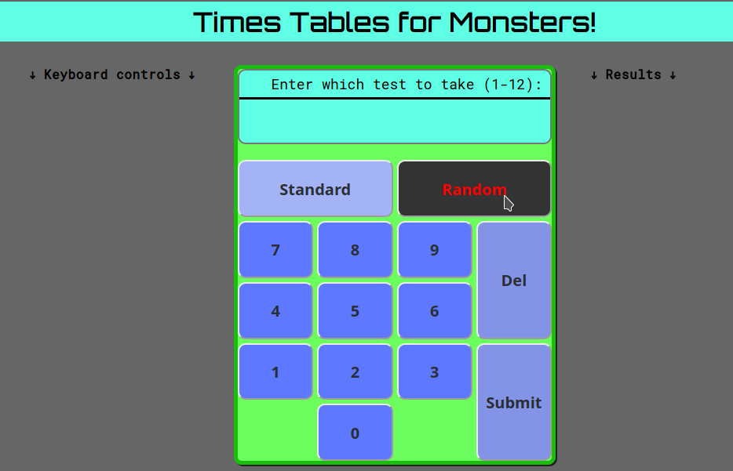

# times-tables

A JavaScript timestables tester developed for my children's school times tables practice. Allows 
times tables from 1 up to 12. The maximum allowed times table can be set in main.js by adjusting the maxFactor constant.

The interface is designed to resemble a calculator with the results of the test displayed to the right of the calculator.

## How to run
The tester is run by loading index.html in a browser (This has been tested in both Chrome and Firefox). The
app is also live at https://richarddenton.github.io/times-tables

## Screenshot

